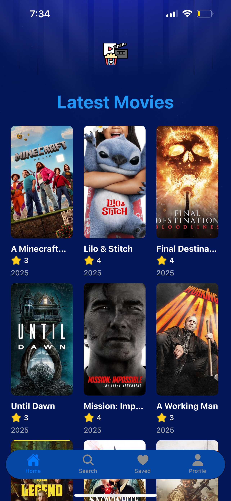
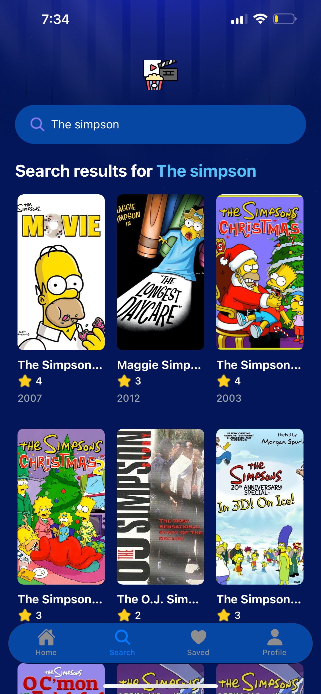
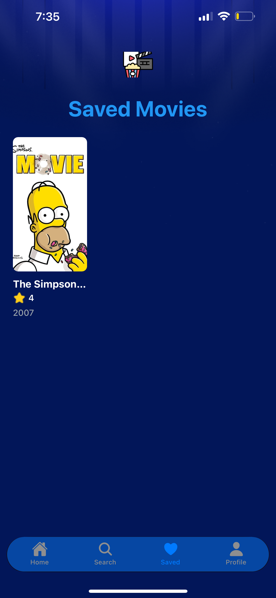
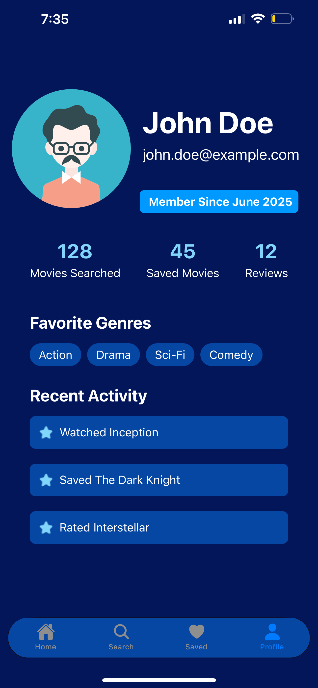
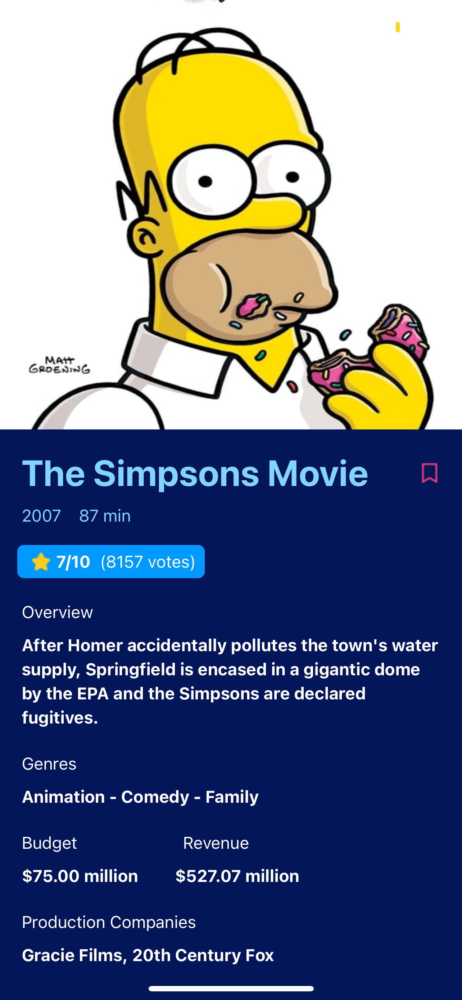

# MovieTime 🎬

[](https://expo.dev/)
[](https://reactnative.dev/)
[](https://www.typescriptlang.org/)
[](https://tailwindcss.com/)
[](https://appwrite.io/)

A modern, feature-rich mobile application for movie enthusiasts, built with Expo and React Native. MovieTime provides a seamless experience for discovering, searching, and saving your favorite movies.

## 🌟 Features

- **Latest Movies**: Browse through the most recent and popular movies
- **Detailed Movie Information**: View comprehensive details including:
  - Movie title, poster, and release date
  - Runtime and rating
  - Plot synopsis
  - Production companies
  - Budget and revenue information
- **Search Functionality**: Find any movie with real-time search results
- **Save Favorites**: Save your favorite movies for quick access
- **Modern UI/UX**: Clean, responsive interface with smooth animations
- **Profile Section**: Personalized user profile (decorative)

## 🚀 Getting Started

### Prerequisites

- Node.js (v14 or higher)
- npm or yarn
- Expo CLI
- iOS Simulator (for iOS development)
- TMDB API key

### Installation

1. Clone the repository:
```bash
git clone https://github.com/yourusername/movietime.git
cd movietime
```

2. Install dependencies:
```bash
npm install
```

3. Create a `.env` file in the root directory and add your TMDB API key:
```env
TMDB_API_KEY=your_api_key_here
```

4. Start the development server:
```bash
npx expo start
```

5. Press 'i' to open in iOS simulator or scan the QR code with your device to open launch it in expo go.

## 🛠 Tech Stack

- **Framework**: Expo & React Native
- **Language**: TypeScript
- **Styling**: Tailwind CSS (via NativeWind)
- **State Management**: React Context
- **API Integration**: TMDB API
- **Backend Services**: Appwrite
- **Navigation**: Expo Router

## 🔧 Environment Setup

Required environment variables:
```env
TMDB_API_KEY=your_tmdb_api_key
```


## 📱 Usage

### Browsing Movies
- Open the app to see the latest movies on the home screen
- Scroll through the grid of movie posters
- Tap any movie to view its details

### Searching Movies
- Navigate to the search tab
- Type the movie title in the search bar
- Results appear in real-time as you type

### Saving Movies
- Open any movie's details
- Tap the heart icon to save/unsave the movie
- View saved movies in the "Saved" tab

## 📸 Screenshots
<div align="center">
  <table>
    <tr>
      <td align="center">
        
        <br />
        <b>Home Tab</b>
      </td>
      <td align="center">
        
        <br />
        <b>Search Tab</b>
      </td>
      <td align="center">
        
        <br />
        <b>Saved Tab</b>
      </td>
    </tr>
    <tr>
      <td align="center">
        
        <br />
        <b>Profile Tab</b>
      </td>
      <td align="center">
        
        <br />
        <b>Movie Details</b>
      </td>
    </tr>
  </table>
</div>


## 📁 Project Structure

```
movietime/
├── app/                   # Main application code
│   ├── (tabs)/            # Tab navigation screens
│   │   ├── index.tsx      # Home screen
│   │   ├── search.tsx     # Search screen
│   │   ├── saved.tsx      # Saved movies screen
│   │   └── profile.tsx    # Profile screen
│   ├── movies/            # Movie-related screens
│   │   └── [id].tsx       # Movie details screen
│   └── _layout.tsx        # Root layout configuration
├── components/            # Reusable components
├── constants/             # App constants and assets
├── context/               # React Context providers
├── interfaces/            # TypeScript interfaces
├── services/              # API and utility services
└── assets/                # Static assets
```

## 📝 License

This project is licensed under the MIT License - see the [LICENSE](LICENSE) file for details.


## 🔮 Future Enhancements

- User authentication
- Social sharing features
- Offline support
- Dark mode
- Movie trailers integration

